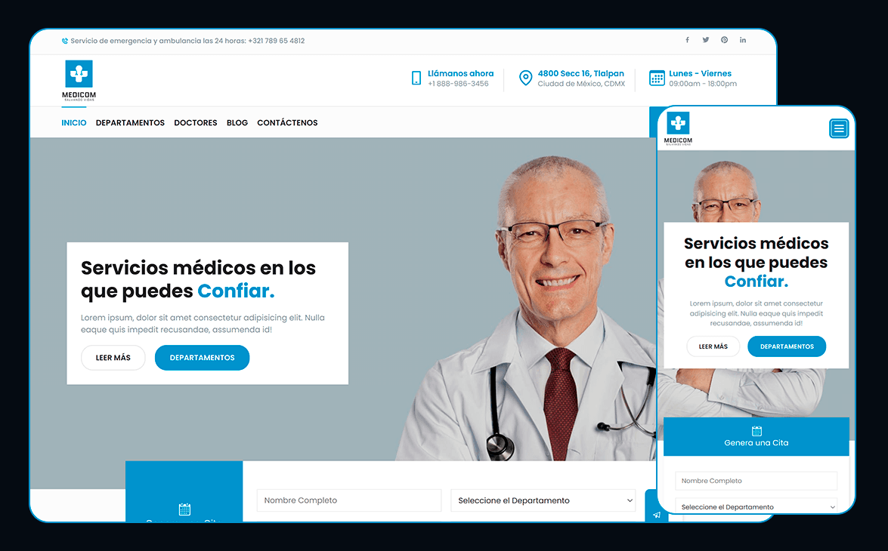

# Medicom - Medical Services

Landing page showing important information about different medical services offered at this hospital. The website is built with React, Sass, SwiperJs, Sweetalert2, React-hook-form and Datepicker.


## Screenshots




## Live Demo

Live Site URL: [Medicom - Medical Services](https://jsarthuro-medicom.netlify.app/)


## Run Locally

Clone the project

```bash
  git clone https://github.com/JessArthuro/medicom.git
```

Go to the project directory

```bash
  cd medicom
```

Install dependencies

```bash
  npm install
```

Start the server

```bash
  npm start
```

Open [http://localhost:3000](http://localhost:3000) to view it in your browser.


## Running Tests

To run tests, run the following command

```bash
  npm test
```


## Deployment To Production

To deploy the application to production, run the following command

```bash
  npm run build
```